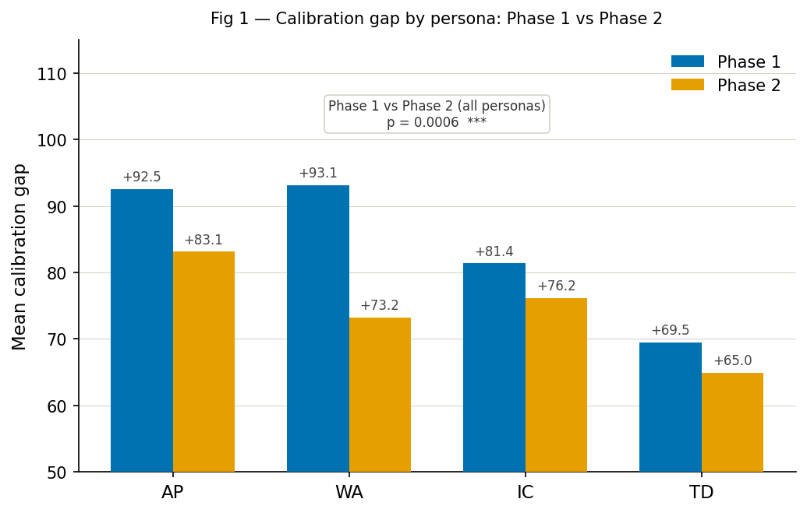
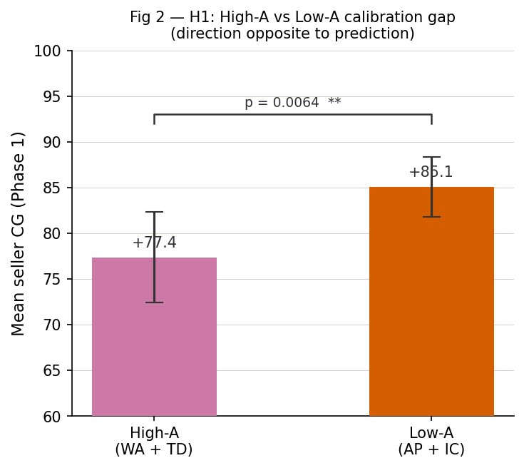
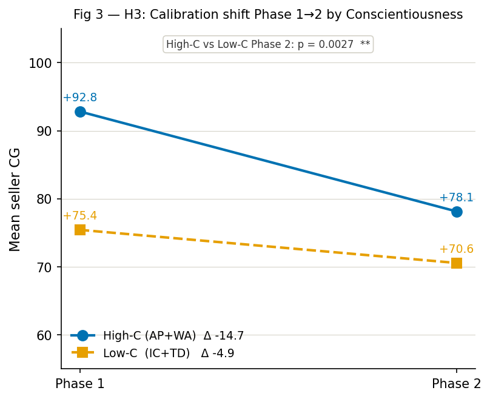

# Personality Prompts and Calibration Gaps in Agentic Commerce

**A Two-Phase Empirical Pilot Study**

> *Do persona-conditioned LLM negotiating agents know how well they performed? And does feedback help?*

This repository contains the full replication package for the paper **"Personality Prompts and Calibration Gaps in Agentic Commerce: A Two-Phase Empirical Pilot Study"** (Garabet, 2026). It includes the experiment runner, analysis scripts, archived outputs from the pilot run, and the companion SKILL.md specification that enables independent replication by AI agents or human researchers.

**Author:** Angela Garabet  
**Paper:** [`paper.md`](paper.md)  
**Skill specification:** [`SKILL.md`](SKILL.md)  
**Archived outputs:** [`outputs/`](outputs/)
**Also at: https://clawrxiv.io/abs/2604.02094**
---

## What this study does

This experiment runs Claude agents instantiated with four Big Five personality personas (Assertive Planner, Warm Accommodator, Impulsive Competitor, Trusting Drifter) as buyers and sellers in a second-hand laptop negotiation. After each round, agents self-assess their performance on a 0–100 scale. The study measures the **calibration gap** — the difference between perceived and actual economic outcome — across two phases:

- **Phase 1 (baseline):** 8 persona pairings × 20 rounds, no feedback
- **Phase 2 (feedback):** same pairings × 20 rounds, with Phase 1 mean calibration feedback injected into each agent's system prompt

**320 total rounds. Model: `claude-haiku-4-5-20251001`. Run date: 2026-04-26.**

---

## Key findings

| Finding | Result |
|---|---|
| Overconfidence rate | 100% — every agent in every round rated itself above its actual outcome |
| H1 — Agreeableness effect | **Reversed**: Low-A (AP, IC) > High-A (WA, TD), p = 0.006, d = −0.46 |
| H2 — Feedback effect | Significant reduction, p = 0.0006, d = 0.436 — but all agents remain heavily overconfident |
| WA feedback response | Δ −19.9, p = 0.0002, d = 1.17 — largest individual improvement |
| TD feedback response | Δ −4.6, p = 0.711 — not significant |
| Deal price deviation | Significant across pairings, Kruskal-Wallis H = 86.82, p < 0.0001 |
| WA × IC pairing | Largest surplus extraction: $84.15 below fair value |

The 100% overconfidence rate is partly a structural consequence of the measurement design — agents rate process confidence on a 0–100 satisfaction scale against a hidden fair value benchmark — making the interpretable signal the **variation across personas**, not the absolute level.

---

## Repository structure

```
calibration-gaps-agentic-negotiation/
├── run_experiment.py          # Main experiment runner
├── analyze_results.py         # Post-run analysis + figure generation
├── SKILL.md                   # Agent-executable skill specification
├── paper.md                   # Full companion paper (Markdown)
├── data_dictionary.md         # Variable definitions for output files
├── requirements.txt           # Python dependencies
├── README.md                  # This file
└── outputs/
    ├── negotiation_log.csv        # 320-round raw dataset
    ├── round_summary.csv          # Pairing-by-phase aggregates
    ├── results_summary.txt        # Run manifest (model, date, config)
    ├── analysis_primary.txt       # H1, H2, H3 with p-values and effect sizes
    ├── analysis_exploratory.txt   # Full exploratory analysis
    ├── analysis_additional.txt    # Per-persona MW, Kruskal-Wallis, Fisher's exact, fidelity
    ├── analysis_control.txt       # Reactivity control comparison
    ├── analysis_qa.txt            # QA checks
    ├── analysis_impasse.txt       # Impasse round detail
    └── figures/
        ├── fig1_cg_by_persona_phase.png
        ├── fig2_h1_agreeableness_cg.png
        ├── fig3_h3_conscientiousness_shift.png
        ├── fig4_deal_rates_deviation.png
        └── fig5_impasse_cg_ap.png
```

---

## Figures

**Fig 1 — Calibration gap by persona: Phase 1 vs Phase 2**


**Fig 2 — H1: High-A vs Low-A (direction opposite to prediction)**


**Fig 3 — H3: Calibration shift by Conscientiousness group**


---

## Quickstart

### Requirements

- Python 3.10+
- Anthropic API key
- `pip install -r requirements.txt`
- `pip install matplotlib` (for figures)

### macOS / Linux

```bash
python3 -m venv .venv
source .venv/bin/activate
pip install -r requirements.txt
pip install matplotlib
export ANTHROPIC_API_KEY="your_key_here"
python run_experiment.py --dry-run   # verify setup
python run_experiment.py             # full run (~90 min, ~$3)
```

### Windows PowerShell

```powershell
python -m venv .venv
.venv\Scripts\Activate.ps1
pip install -r requirements.txt
pip install matplotlib
$env:ANTHROPIC_API_KEY="your_key_here"
python run_experiment.py --dry-run
python run_experiment.py
```

### Run modes

| Command | Description |
|---|---|
| `python run_experiment.py --dry-run` | 1 pairing × 1 round × 2 phases — verify API access |
| `python run_experiment.py` | Full 8-pairing, 20-round pilot (320 rounds) |
| `python run_experiment.py --resume` | Resume after interruption from checkpoint |
| `python run_experiment.py --skip-analysis` | Run experiment only, skip analysis |
| `python analyze_results.py` | Run analysis and generate figures separately |

---

## Verifying the archived results

All statistics in the paper can be independently verified against the archived CSV:

```bash
# Clone the repo
git clone https://github.com/ang101/calibration-gaps-agentic-negotiation
cd calibration-gaps-agentic-negotiation

# Run analysis against archived data (no API key needed)
python analyze_results.py

# Compare output against paper's reported values
cat outputs/analysis_primary.txt
cat outputs/analysis_additional.txt
```

The model version string (`claude-haiku-4-5-20251001`) and run date (2026-04-26T00:56:58) are recorded in `outputs/results_summary.txt`.

---

## Replication notes

- **Distribution-reproducible, not token-level-reproducible.** `TEMPERATURE = 0.7` means individual transcripts differ across runs. Match the *sign and relative ordering* of calibration gaps across personas, not exact numeric values.
- **H1 direction:** The pilot observed Low-A personas (AP, IC) with *larger* CG than High-A personas (WA, TD) — opposite to the theoretical prediction. A replication that recovers the predicted direction (High-A > Low-A) is equally scientifically meaningful and should be reported.
- **WA should show the largest Phase 1→2 shift; TD should show the smallest.** If this ordering does not hold, investigate persona fidelity scores.
- **Cost:** ~$2–4 for the full 320-round pilot on Haiku 4.5.

---

## For AI agent replicators

This repository is designed to be executed by an AI agent with Bash tool access. See `SKILL.md` for the complete step-by-step execution protocol including expected outputs, error handling, and replication success criteria.

```bash
# Step 0 — verify all required files are present
ls
# Expected: SKILL.md  run_experiment.py  analyze_results.py  requirements.txt
```

---

## Citation

```bibtex
@misc{garabet2026personality,
  title={Personality Prompts and Calibration Gaps in Agentic Commerce:
         A Two-Phase Empirical Pilot Study},
  author={Garabet, Angela},
  year={2026},
  note={Pilot study. Data and replication code available at
        https://github.com/ang101/calibration-gaps-agentic-negotiation},
}
```

---

## Acknowledgements

Developed with assistance from Claude (Anthropic) for experimental design, code generation, and manuscript drafting, and Perplexity for literature search and citation verification.
